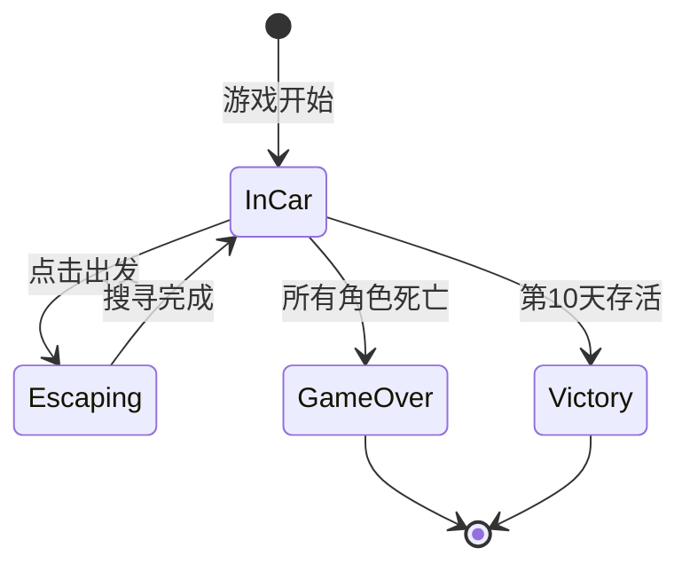

# X-Escape 技术架构文档

## 一、架构概览

X-Escape采用经典的Unity分层架构，结合单例管理器模式和事件驱动设计，实现了模块化、可扩展的游戏系统。

### 1.1 架构图

```
┌─────────────────────────────────────────────────────────┐
│                    表现层 (Presentation)                  │
│  ┌──────────────┐  ┌──────────────┐  ┌──────────────┐  │
│  │   UI组件     │  │  场景视觉    │  │  动画特效    │  │
│  │  (UI/)       │  │  (Sprites)   │  │  (Effects)   │  │
│  └──────────────┘  └──────────────┘  └──────────────┘  │
└─────────────────────────────────────────────────────────┘
                           ↕
┌─────────────────────────────────────────────────────────┐
│                   业务逻辑层 (Business Logic)             │
│  ┌──────────────┐  ┌──────────────┐  ┌──────────────┐  │
│  │  场景控制器  │  │  游戏系统    │  │  数据管理    │  │
│  │ (CarScene/)  │  │(Inventory/)  │  │(Managers/)   │  │
│  │(EscapeScene/)│  │              │  │              │  │
│  │(PickupScene/)│  │              │  │              │  │
│  └──────────────┘  └──────────────┘  └──────────────┘  │
└─────────────────────────────────────────────────────────┘
                           ↕
┌─────────────────────────────────────────────────────────┐
│                    管理层 (Management)                    │
│  ┌──────────┐ ┌──────────┐ ┌──────────┐ ┌──────────┐  │
│  │  Game    │ │   Day    │ │  Item    │ │ Scene    │  │
│  │ Manager  │ │ Manager  │ │ Manager  │ │Transition│  │
│  └──────────┘ └──────────┘ └──────────┘ └──────────┘  │
│  ┌──────────┐ ┌──────────┐ ┌──────────┐              │
│  │ Resource │ │ItemInstan│ │Character │              │
│  │ Manager  │ │ceManager │ │ItemData  │              │
│  └──────────┘ └──────────┘ └──────────┘              │
└─────────────────────────────────────────────────────────┘
                           ↕
┌─────────────────────────────────────────────────────────┐
│                   工具层 (Utilities)                      │
│  ┌──────────────┐  ┌──────────────┐  ┌──────────────┐  │
│  │  编辑器工具  │  │  辅助工具类  │  │  扩展方法    │  │
│  │  (Editor/)   │  │ (Utilities/) │  │ (Extensions) │  │
│  └──────────────┘  └──────────────┘  └──────────────┘  │
└─────────────────────────────────────────────────────────┘
                           ↕
┌─────────────────────────────────────────────────────────┐
│                   Unity引擎层 (Engine)                    │
│     GameObject, Component, Transform, Physics, etc.      │
└─────────────────────────────────────────────────────────┘
```

### 1.2 核心设计模式

#### 单例模式 (Singleton Pattern)
所有Manager类都采用单例模式，确保全局唯一性：

```csharp
public class GameManager : MonoBehaviour
{
    private static GameManager instance;
    public static GameManager Instance
    {
        get
        {
            if (instance == null)
            {
                instance = FindObjectOfType<GameManager>();
                if (instance == null)
                {
                    GameObject go = new GameObject("GameManager");
                    instance = go.AddComponent<GameManager>();
                }
            }
            return instance;
        }
    }

    private void Awake()
    {
        if (instance == null)
        {
            instance = this;
            DontDestroyOnLoad(gameObject);
        }
        else if (instance != this)
        {
            Destroy(gameObject);
        }
    }
}
```

**优点**:
- 全局访问点
- 跨场景持久化
- 防止重复实例

#### 观察者模式 (Observer Pattern)
使用UnityEvent和C#事件实现松耦合通信：

```csharp
// 事件定义
public class DayManager : MonoBehaviour
{
    public static event System.Action<int> OnDayChanged;
    public static event System.Action OnDayStarted;
    public static event System.Action OnDayEnded;

    private void AdvanceDay()
    {
        currentDay++;
        OnDayChanged?.Invoke(currentDay);
    }
}

// 事件订阅
public class DayTitleDisplay : MonoBehaviour
{
    private void OnEnable()
    {
        DayManager.OnDayChanged += UpdateDayTitle;
    }

    private void OnDisable()
    {
        DayManager.OnDayChanged -= UpdateDayTitle;
    }

    private void UpdateDayTitle(int day)
    {
        // 更新显示
    }
}
```

#### 对象池模式 (Object Pool Pattern)
物品生成使用对象池优化性能：

```csharp
public class ItemSpawner : MonoBehaviour
{
    private Queue<GameObject> itemPool = new Queue<GameObject>();

    private GameObject GetPooledItem()
    {
        if (itemPool.Count > 0)
        {
            GameObject item = itemPool.Dequeue();
            item.SetActive(true);
            return item;
        }
        else
        {
            return Instantiate(itemPrefab);
        }
    }

    private void ReturnToPool(GameObject item)
    {
        item.SetActive(false);
        itemPool.Enqueue(item);
    }
}
```

#### 策略模式 (Strategy Pattern)
物品类型使用策略模式实现不同行为：

```csharp
public abstract class Item
{
    public abstract void Use(CarOccupant target);
}

public class FoodItem : Item
{
    public override void Use(CarOccupant target)
    {
        target.RestoreHunger(hungerRestore);
    }
}

public class DisguiseItem : Item
{
    public override void Use(CarOccupant target)
    {
        target.RestoreDisguise(disguiseRestore);
    }
}
```

## 二、核心系统架构

### 2.1 游戏状态管理系统

#### GameManager架构

```
GameManager
├─ 游戏状态 (GameState Enum)
│  ├─ InCar: 车内场景
│  ├─ Escaping: 逃亡场景
│  ├─ GameOver: 游戏结束
│  └─ Victory: 游戏胜利
│
├─ 状态转换
│  ├─ StartGame()
│  ├─ StartEscaping()
│  ├─ ReturnToCar()
│  ├─ GameOver()
│  └─ Victory()
│
└─ 全局状态
   ├─ 当前游戏状态
   ├─ 游戏是否暂停
   └─ 游戏配置参数
```

#### 状态转换流程



### 2.2 天数管理系统

#### DayManager架构

```
DayManager
├─ 天数追踪
│  ├─ currentDay: 当前天数（1-10）
│  ├─ totalDays: 总天数（10）
│  └─ dayHistory: 天数历史记录
│
├─ 天数推进
│  ├─ AdvanceDay(): 推进到下一天
│  ├─ SettleItems(): 物品结算
│  ├─ UpdateCharacterStates(): 更新角色状态
│  └─ CheckVictoryCondition(): 检查胜利条件
│
└─ 事件系统
   ├─ OnDayChanged(int day)
   ├─ OnDayStarted()
   ├─ OnDayEnded()
   └─ OnItemsSettled()
```

#### 天数推进详细流程

```csharp
public void AdvanceDay()
{
    // 1. 显示天数标题
    ShowDayTitle();

    // 2. 执行物品结算
    SettleItems();

    // 3. 更新角色状态
    UpdateCharacterStates();

    // 4. 检查死亡条件
    CheckDeathConditions();

    // 5. 清理物品实例
    ClearItemInstances();

    // 6. 推进天数
    currentDay++;
    OnDayChanged?.Invoke(currentDay);

    // 7. 检查游戏结束
    if (currentDay > totalDays)
    {
        CheckVictoryCondition();
    }
    else
    {
        // 切换到逃亡场景
        SceneTransitionManager.Instance.LoadScene("EscapeScene");
    }
}
```

### 2.3 物品管理系统

#### 三层物品追踪架构

```
┌─────────────────────────────────────────────┐
│          ItemManager (库存管理)              │
│  - 管理可用物品列表                          │
│  - 控制物品数量                              │
│  - 物品显示/隐藏                             │
└─────────────────────────────────────────────┘
                    ↕
┌─────────────────────────────────────────────┐
│     ItemInstanceManager (实例管理)           │
│  - 追踪GameObject实例                        │
│  - 管理物品在场景中的存在                    │
│  - 负责创建和销毁                            │
└─────────────────────────────────────────────┘
                    ↕
┌─────────────────────────────────────────────┐
│  CharacterItemDataManager (数据管理)         │
│  - 存储角色物品持有状态 (bool)               │
│  - 跨场景数据持久化                          │
│  - 用于结算时的逻辑判断                      │
└─────────────────────────────────────────────┘
```

#### 物品赋予流程

```
用户拖动物品到角色
       ↓
ItemDropZone.OnDrop()
       ↓
┌─────────────────────────────────────────┐
│ 1. 检查是否已有该类型物品                │
│ 2. 生成物品GameObject实例                │
│ 3. ItemInstanceManager.SetItem()         │
│    - 记录GameObject引用                   │
│ 4. CharacterItemDataManager.SetHasFood() │
│    - 设置hasFood = true                   │
│ 5. ItemManager.UseItem()                 │
│    - 库存数量 - 1                         │
│ 6. 显示取消按钮                           │
└─────────────────────────────────────────┘
```

#### 物品结算流程

```
DayManager.SettleItems()
       ↓
遍历所有角色
       ↓
┌─────────────────────────────────────────┐
│ 对于每个角色:                             │
│                                           │
│ 1. 检查食物状态                           │
│    if (hasFood) {                        │
│        饱腹度 = 100                       │
│        hasFood = false                   │
│    } else {                              │
│        饱腹度 -= 20                       │
│    }                                     │
│                                           │
│ 2. 检查伪装状态                           │
│    if (hasDisguise) {                    │
│        伪装度 = 100                       │
│        hasDisguise = false               │
│    } else {                              │
│        伪装度 -= 20                       │
│    }                                     │
│                                           │
│ 3. 检查死亡条件                           │
│    if (饱腹度 == 0 && 上次饱腹度 == 0) { │
│        角色死亡                           │
│    }                                     │
└─────────────────────────────────────────┘
       ↓
清理所有物品GameObject实例
(ItemInstanceManager.ClearAllItems())
```

### 2.4 角色状态系统

#### CarOccupant架构

```
CarOccupant (角色类)
├─ 状态属性
│  ├─ hungerLevel: 饱腹度 (0-100)
│  ├─ disguiseLevel: 伪装度 (0-100)
│  ├─ isAlive: 是否存活
│  ├─ daysAtZeroHunger: 饱腹度为0的天数
│  └─ characterID: 角色唯一ID
│
├─ 状态管理
│  ├─ UpdateHunger(int amount): 更新饱腹度
│  ├─ UpdateDisguise(int amount): 更新伪装度
│  ├─ RestoreHunger(): 恢复饱腹度到100
│  ├─ RestoreDisguise(): 恢复伪装度到100
│  └─ CheckDeath(): 检查死亡条件
│
├─ 档位系统
│  ├─ GetHungerTier(): 获取饱腹度档位 (1-5)
│  ├─ GetDisguiseTier(): 获取伪装度档位 (1-5)
│  ├─ GetHungerColor(): 获取饱腹度颜色
│  └─ GetDisguiseColor(): 获取伪装度颜色
│
└─ 视觉反馈
   ├─ UpdateVisuals(): 更新角色外观
   ├─ ShowDeathEffect(): 显示死亡效果
   └─ UpdateTooltip(): 更新提示框
```

#### 档位计算算法

```csharp
public int GetTier(int value)
{
    // 5档制: 每档20点
    if (value >= 75) return 5; // 75-100
    if (value >= 50) return 4; // 50-74
    if (value >= 25) return 3; // 25-49
    if (value > 0)   return 2; // 1-24
    return 1;                   // 0
}

public Color GetTierColor(int tier)
{
    switch (tier)
    {
        case 5: return Color.green;     // 绿色（良好）
        case 4: return Color.yellow;    // 黄色（正常）
        case 3: return new Color(1, 0.5f, 0); // 橙色（警告）
        case 2: return Color.red;       // 红色（危险）
        case 1: return Color.black;     // 黑色（致命）
        default: return Color.white;
    }
}
```

### 2.5 场景管理系统

#### SceneTransitionManager架构

```
SceneTransitionManager
├─ 场景加载
│  ├─ LoadScene(string sceneName)
│  ├─ LoadSceneAsync(string sceneName)
│  └─ ReloadCurrentScene()
│
├─ 转场效果
│  ├─ FadeOut(): 淡出效果
│  ├─ FadeIn(): 淡入效果
│  ├─ CrossFade(): 交叉淡化
│  └─ CustomTransition(): 自定义转场
│
├─ 场景栈管理
│  ├─ previousScene: 上一个场景
│  ├─ currentScene: 当前场景
│  └─ sceneHistory: 场景历史栈
│
└─ 加载状态
   ├─ isLoading: 是否正在加载
   ├─ loadProgress: 加载进度 (0-1)
   └─ OnSceneLoaded: 场景加载完成事件
```

#### 场景切换流程

```
用户触发切换（点击按钮）
       ↓
SceneTransitionManager.LoadScene()
       ↓
┌─────────────────────────────────────────┐
│ 1. 设置 isLoading = true                 │
│ 2. 触发 OnTransitionStart 事件           │
│ 3. 播放淡出动画 (FadeOut)                │
│    - 黑色遮罩 Alpha: 0 → 1               │
│    - 持续时间: 0.5秒                      │
│ 4. 等待淡出完成                           │
│ 5. 调用 SceneManager.LoadSceneAsync()   │
│    - 异步加载场景                         │
│    - 显示加载进度条（可选）               │
│ 6. 等待场景加载完成                       │
│ 7. 播放淡入动画 (FadeIn)                 │
│    - 黑色遮罩 Alpha: 1 → 0               │
│    - 持续时间: 0.5秒                      │
│ 8. 触发 OnSceneLoaded 事件               │
│ 9. 设置 isLoading = false                │
└─────────────────────────────────────────┘
```

## 三、数据流架构

### 3.1 数据流向图

```
用户输入 (Input)
       ↓
┌─────────────────┐
│  UI Controller   │ (Button, DragDrop)
└─────────────────┘
       ↓
┌─────────────────┐
│  Scene Logic    │ (ItemDropZone, ViewSwitcher)
└─────────────────┘
       ↓
┌─────────────────┐
│   Managers      │ (ItemManager, DayManager)
└─────────────────┘
       ↓
┌─────────────────┐
│  Data Models    │ (CarOccupant, Item)
└─────────────────┘
       ↓
┌─────────────────┐
│  Data Storage   │ (CharacterItemDataManager)
└─────────────────┘
       ↓
持久化数据 (DontDestroyOnLoad)
```

### 3.2 关键数据结构

#### 角色数据

```csharp
[System.Serializable]
public class CharacterData
{
    public string characterID;
    public string characterName;
    public int hungerLevel;        // 0-100
    public int disguiseLevel;      // 0-100
    public bool isAlive;
    public int daysAtZeroHunger;   // 连续饱腹度为0的天数

    // 物品持有状态
    public bool hasFood;
    public bool hasDisguise;

    // 统计数据
    public int totalFoodConsumed;
    public int totalDisguisesUsed;
}
```

#### 物品数据

```csharp
[System.Serializable]
public class ItemData
{
    public string itemID;
    public string itemName;
    public ItemType itemType;      // Food, Disguise, etc.
    public Sprite icon;
    public int restoreAmount;      // 恢复量
    public string description;
    public int quantity;           // 库存数量
}
```

#### 游戏存档数据

```csharp
[System.Serializable]
public class GameSaveData
{
    public int currentDay;
    public List<CharacterData> characters;
    public List<ItemData> inventory;
    public GameState gameState;
    public float playtime;
    public string saveDate;
}
```

## 四、性能优化策略

### 4.1 对象池优化

```csharp
public class ItemPoolManager : MonoBehaviour
{
    private Dictionary<string, Queue<GameObject>> pools;

    public GameObject GetItem(string itemID)
    {
        if (!pools.ContainsKey(itemID))
        {
            pools[itemID] = new Queue<GameObject>();
        }

        if (pools[itemID].Count > 0)
        {
            GameObject item = pools[itemID].Dequeue();
            item.SetActive(true);
            return item;
        }
        else
        {
            // 创建新实例
            return CreateNewItem(itemID);
        }
    }

    public void ReturnItem(string itemID, GameObject item)
    {
        item.SetActive(false);
        pools[itemID].Enqueue(item);
    }
}
```

### 4.2 事件订阅管理

```csharp
public class EventManager : MonoBehaviour
{
    private Dictionary<string, System.Action> events;

    public void Subscribe(string eventName, System.Action callback)
    {
        if (!events.ContainsKey(eventName))
        {
            events[eventName] = null;
        }
        events[eventName] += callback;
    }

    public void Unsubscribe(string eventName, System.Action callback)
    {
        if (events.ContainsKey(eventName))
        {
            events[eventName] -= callback;
        }
    }

    public void Trigger(string eventName)
    {
        events[eventName]?.Invoke();
    }
}
```

### 4.3 资源异步加载

```csharp
public class ResourceLoader : MonoBehaviour
{
    public IEnumerator LoadResourceAsync<T>(string path, System.Action<T> callback) where T : UnityEngine.Object
    {
        ResourceRequest request = Resources.LoadAsync<T>(path);
        yield return request;

        if (request.asset != null)
        {
            callback?.Invoke(request.asset as T);
        }
        else
        {
            Debug.LogError($"Failed to load resource: {path}");
        }
    }
}
```

## 五、扩展性设计

### 5.1 模块化设计

每个系统都设计为独立模块，可以单独测试和扩展：

```
System Interface
├─ IGameSystem
│  ├─ Initialize()
│  ├─ Update()
│  └─ Cleanup()
│
├─ IInventorySystem
│  ├─ AddItem()
│  ├─ RemoveItem()
│  └─ GetItem()
│
└─ ICharacterSystem
   ├─ UpdateState()
   ├─ CheckDeath()
   └─ Restore()
```

### 5.2 插件化扩展

```csharp
public interface IGamePlugin
{
    string PluginName { get; }
    string Version { get; }
    void OnLoad();
    void OnUnload();
}

public class PluginManager : MonoBehaviour
{
    private List<IGamePlugin> loadedPlugins;

    public void LoadPlugin(IGamePlugin plugin)
    {
        plugin.OnLoad();
        loadedPlugins.Add(plugin);
        Debug.Log($"Plugin loaded: {plugin.PluginName} v{plugin.Version}");
    }

    public void UnloadPlugin(IGamePlugin plugin)
    {
        plugin.OnUnload();
        loadedPlugins.Remove(plugin);
    }
}
```

## 六、测试架构

### 6.1 单元测试结构

```
Tests/
├─ EditMode/           # 编辑器模式测试
│  ├─ ManagerTests/
│  │  ├─ GameManagerTests.cs
│  │  ├─ ItemManagerTests.cs
│  │  └─ DayManagerTests.cs
│  ├─ SystemTests/
│  │  ├─ InventorySystemTests.cs
│  │  └─ CharacterSystemTests.cs
│  └─ UtilityTests/
│
└─ PlayMode/           # 运行时测试
   ├─ IntegrationTests/
   │  ├─ GameFlowTests.cs
   │  └─ SceneTransitionTests.cs
   └─ PerformanceTests/
      ├─ ItemSpawningTests.cs
      └─ MemoryLeakTests.cs
```

### 6.2 测试示例

```csharp
[TestFixture]
public class ItemManagerTests
{
    private ItemManager itemManager;

    [SetUp]
    public void SetUp()
    {
        GameObject go = new GameObject();
        itemManager = go.AddComponent<ItemManager>();
    }

    [Test]
    public void AddItem_ShouldIncreaseInventoryCount()
    {
        // Arrange
        int initialCount = itemManager.GetItemCount("food_01");

        // Act
        itemManager.AddItem("food_01", 1);

        // Assert
        Assert.AreEqual(initialCount + 1, itemManager.GetItemCount("food_01"));
    }

    [TearDown]
    public void TearDown()
    {
        UnityEngine.Object.Destroy(itemManager.gameObject);
    }
}
```

## 七、未来扩展方向

### 7.1 可能的新系统

1. **事件系统**
   - 随机遭遇事件
   - 警察检查站
   - 道路事故

2. **任务系统**
   - 主线任务
   - 支线任务
   - 成就系统

3. **升级系统**
   - 车辆升级
   - 角色技能
   - 物品强化

4. **多人模式**
   - 合作逃亡
   - 竞技模式

### 7.2 技术债务和改进

1. **代码重构**
   - 统一命名规范
   - 提取公共接口
   - 优化Manager依赖关系

2. **性能优化**
   - 实现更完善的对象池
   - 优化Update循环
   - 减少GC分配

3. **工具链改进**
   - 完善编辑器工具
   - 添加自动化测试
   - 集成CI/CD

---

**文档版本**: 1.0
**更新日期**: 2026-01-25
**作者**: 开发团队
**适用项目版本**: 第一阶段开发完成
